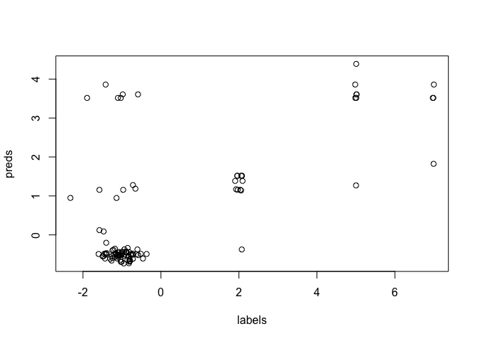

<!-- README.md is generated from README.Rmd. Please edit that file -->

# faLearn

<!-- badges: start -->

[](https://github.com/agerada/faLearn/actions/workflows/R-CMD-check.yaml)
<!-- badges: end -->

## Introduction

`faLearn` provides utilities to transform whole-genome sequence data
into feature representations suitable for machine learning, with a focus
on $k$-mer based features and XGBoost-compatible input (libsvm). The
package is intended for workflows that start from raw or assembled
genome FASTA/FNA files and end with model-ready data.

This repository is an offshot of the [`MIC`](github.com/agerada/MIC)
package. For MIC analysis functions, please refer to that package.

## Main features

- Convert individual genomes (FASTA/FNA) into $k$-mer counts.
- Export $k$-mer counts in XGBoost-friendly libsvm format (one .txt per
  genome).
- Fast $k$-mer counting implemented in C++ (Rcpp) for performance.
- Helpers to process directories of genomes in parallel (via
  future.apply) and to split/combine libsvm files for
  training/validation workflows.
- Memory-efficient XGBoost cross-validation using
  [xgb.cv.lowmem](man/xgb.cv.lowmem.Rd).

## Installation

Install from GitHub (development version):

``` r
# install.packages("remotes")
remotes::install_github("agerada/faLearn")
```

## Quick examples

[`libsvm`]( "https://xgboost.readthedocs.io/en/stable/tutorials/input_format.html")
is the preferred input format for XGBoost. Data are represented as a
sparce matrix in a special text format.

To convert a directory of genomes (.fna or .fasta) directly to libsvm
files (one line per genome):

``` r
library(faLearn)
data("example_genomes", package = "faLearn")

# use the first genome from the packaged example_genomes
genome_ds <- example_genomes$genomes[[1]]
tmp_out <- file.path(tempdir(), "kmers")
unlink(tmp_out, recursive = TRUE)
dir.create(tmp_out, recursive = TRUE, showWarnings = FALSE)
target_file <- file.path(normalizePath(tmp_out), paste0(names(example_genomes$genomes)[1], ".txt"))
future::plan(future::sequential) # or multisession, etc.
progressr::with_progress({
  genome_to_libsvm(as.character(genome_ds),
                   target_file,
                   k = 5)
})
#> Loading required namespace: Biostrings
#> [1] TRUE
```

Count $k$-mers for a single sequence string using the fast C++
implementation:

``` r
kmers("ATCGATCGA", k = 3)
#> $kmer_string
#>  [1] "AAA" "AAC" "AAG" "AAT" "ACA" "ACC" "ACG" "ACT" "AGA" "AGC" "AGG" "AGT"
#> [13] "ATA" "ATC" "ATG" "ATT" "CAA" "CAC" "CAG" "CAT" "CCA" "CCC" "CCG" "CCT"
#> [25] "CGA" "CGC" "CGG" "CGT" "CTA" "CTC" "CTG" "CTT" "GAA" "GAC" "GAG" "GAT"
#> [37] "GCA" "GCC" "GCG" "GCT" "GGA" "GGC" "GGG" "GGT" "GTA" "GTC" "GTG" "GTT"
#> [49] "TAA" "TAC" "TAG" "TAT" "TCA" "TCC" "TCG" "TCT" "TGA" "TGC" "TGG" "TGT"
#> [61] "TTA" "TTC" "TTG" "TTT"
#> 
#> $kmer_value
#>  [1] 0 0 0 0 0 0 0 0 0 0 0 0 0 3 0 0 0 0 0 0 0 0 0 0 4 0 0 0 0 0 0 0 0 0 0 0 0 0
#> [39] 0 0 0 0 0 0 0 0 0 0 0 0 0 0 0 0 0 0 0 0 0 0 0 0 0 0
```

Train a small XGBoost model (cross-validated) using $k$-mer features and
`xgb.cv.lowmem`. This example simulates a numeric phenotype (e.g., an
MIC value in this case) and demonstrates how to build a feature matrix
from multiple genome files.

``` r
data("example_genomes", package = "faLearn")

genomes_list <- example_genomes$genomes

# create kmer libsvm features saved to disk
tmp_out <- file.path(tempdir(), "kmers_all")
unlink(tmp_out, recursive = TRUE)
dir.create(tmp_out, recursive = TRUE, showWarnings = FALSE)
future::plan(future::sequential) # or multisession, etc.
progressr::handlers("txtprogressbar")
progressr::with_progress({
  # iterate over genomes by index so we can use the genome id (not contig names)
  for (i in seq_along(genomes_list)) {
    g <- genomes_list[[i]]
    gid <- names(genomes_list)[i]
    target_file <- file.path(normalizePath(tmp_out), paste0(gid, ".txt"))
    genome_to_libsvm(as.character(g), target_file, k = 8)
  }
})

# combine all libsvm files into a single train file (no test split)
# disable shuffling to preserve filename order and align labels
combined_paths <- split_and_combine_files(tmp_out, split = 1.0, overwrite = TRUE, shuffle = FALSE)
train_file <- combined_paths[["train"]]

# align labels to the order used in the combined train file
train_names <- combined_paths[["train_names"]]
# train_names are basenames with .txt; strip to get genome IDs
train_ids <- tools::file_path_sans_ext(train_names)
all_ids <- names(example_genomes$genomes)
id_index <- match(train_ids, all_ids)
labels <- example_genomes$labels[id_index]

# load combined libsvm file into xgboost DMatrix
dtrain <- xgboost::xgb.DMatrix(data = train_file, label = labels)

# run low-memory CV
cv <- xgb.cv.lowmem(data = dtrain,
                    params = list(eta = 0.05),
                    nrounds = 2000,
                    nfold = 3,
                    verbose = 0,
                    early_stopping_rounds = 5,
                    prediction = TRUE)

head(cv$evaluation_log)
#>   iter train_rmse_mean train_rmse_std test_rmse_mean test_rmse_std
#> 1    1        2.204962     0.08800962       2.224972     0.1681292
#> 2    2        2.109566     0.08404007       2.157574     0.1638208
#> 3    3        2.018659     0.08030880       2.097276     0.1612254
#> 4    4        1.932029     0.07677881       2.041901     0.1609919
#> 5    5        1.849487     0.07344387       1.992596     0.1607482
#> 6    6        1.770839     0.07031310       1.947898     0.1625535

# compare predictions to true labels
preds <- cv$pred
plot(labels, preds)
```



``` r
cor(preds, labels)
#> [1] 0.6772776
```

## Contact

Report issues or feature requests on the GitHub repository:
<https://github.com/agerada/faLearn>

## Author

[Alessandro Gerada](mailto:alessandro.gerada@liverpool.ac.uk)
